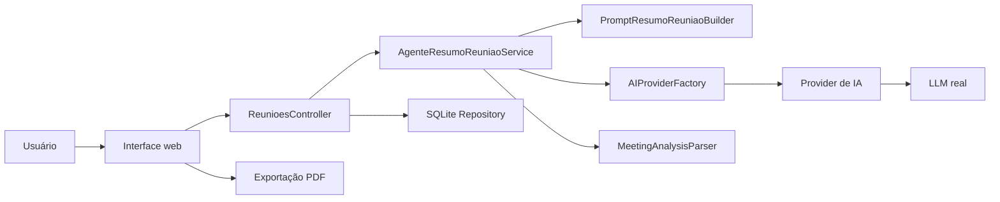

# EasyMeet

EasyMeet é uma plataforma inteligente para análise de reuniões com IA. A aplicação recebe transcrições em texto, permite selecionar dinamicamente o provedor/modelo de IA e retorna uma análise estruturada com resumo executivo, tópicos principais, ações, responsáveis, decisões, pendências, classificação da reunião e nível de confiança.

O projeto foi desenvolvido em ASP.NET Core .NET 9 com Web API, Swagger, interface web local, persistência SQLite, exportação PDF, testes automatizados e CI com GitHub Actions.

## Problema

Reuniões geram informações importantes, mas atas manuais consomem tempo, perdem contexto e dificultam o acompanhamento de decisões e responsabilidades. O EasyMeet transforma transcrições em informação operacional, reduzindo retrabalho e tornando o histórico pesquisável.

## Papel da IA

A IA é parte funcional do produto. Ela interpreta a transcrição e estrutura automaticamente:

- resumo executivo;
- tópicos principais;
- ações e responsáveis;
- decisões tomadas;
- pendências;
- data identificada;
- tipo de reunião;
- nível de confiança.

O sistema usa LLMs reais por HTTP. Não há geração local simulada para substituir uma análise válida.

## Funcionalidades

- Análise de reuniões por transcrição em texto.
- Seleção dinâmica de provedor de IA.
- Seleção opcional de modelo, temperatura e máximo de tokens.
- Suporte a OpenRouter e providers diretos.
- Armazenamento seguro de API keys por provedor.
- Histórico local das análises em SQLite.
- Visualização do histórico com filtros.
- Registro do provedor e modelo usado em cada análise.
- Exportação da análise em PDF.
- Swagger para exploração da API.
- Interface web local moderna.
- Testes automatizados xUnit.
- Pipeline GitHub Actions para build e testes.

## Providers de IA

Providers implementados:

- `OpenRouter`
- `Gemini`
- `Groq`
- `OpenAI`
- `Anthropic`
- `Mistral`
- `Cohere`

O OpenRouter oferece acesso a diversos modelos por uma única chave. Os providers diretos permanecem implementados para quem deseja usar APIs oficiais, reduzir dependência de agregadores ou comparar custo, latência e qualidade.

Modelos Grok/xAI podem ser usados quando estiverem disponíveis na conta OpenRouter configurada.

## Tecnologias

- .NET 9
- ASP.NET Core Web API
- Controllers
- Swagger / OpenAPI
- HttpClient
- xUnit
- SQLite
- JavaScript, HTML e CSS
- jsPDF
- GitHub Actions
- Windows Credential Manager

## Arquitetura

O backend usa uma arquitetura organizada em camadas simples:

- `Controllers`: endpoints HTTP e validações de entrada.
- `Services`: orquestração da análise, parser, repositório, factory e credenciais.
- `Providers`: clientes HTTP para cada provedor de IA.
- `Models`: contratos, entidades e configurações.
- `Prompts`: prompt-base do agente de análise.
- `wwwroot`: interface web local.

Fluxo resumido:



## Estrutura

```text
EasyMeet/
|-- src/
|   `-- EasyMeet.Api/
|       |-- Controllers/
|       |-- Models/
|       |-- Prompts/
|       |-- Providers/
|       |-- Services/
|       `-- wwwroot/
|-- tests/
|   `-- EasyMeet.Tests/
|-- docs/
|-- .github/
|   `-- workflows/
|-- README.md
`-- EasyMeet.sln
```

## Como executar

```powershell
dotnet restore EasyMeet.sln
dotnet build EasyMeet.sln
dotnet run --project .\src\EasyMeet.Api\EasyMeet.Api.csproj
```

A aplicação fica disponível em:

- `http://localhost:5086`
- Swagger: `http://localhost:5086/swagger`

## Configuração de API Keys

As chaves são configuradas pela própria interface:

1. Abra `Configuração IA`.
2. Selecione o provider.
3. Informe a API key.
4. Clique em `Salvar`.
5. Use `Testar conexão` para validar.

As chaves são armazenadas no Windows Credential Manager e não devem ser colocadas em `appsettings.json`, logs ou arquivos do repositório.

Links úteis:

- OpenRouter: `https://openrouter.ai/workspaces/default/keys`
- Gemini: `https://aistudio.google.com/`
- Groq: `https://console.groq.com/keys`
- OpenAI: `https://platform.openai.com/api-keys`
- Anthropic: `https://console.anthropic.com/settings/keys`
- Mistral: `https://console.mistral.ai/api-keys/`
- Cohere: `https://dashboard.cohere.com/api-keys`

## Exemplo de request

```http
POST /api/reunioes/analisar
Content-Type: application/json
```

```json
{
  "transcricao": "Conteúdo da reunião...",
  "provedorIA": "OpenRouter",
  "configuracaoIA": {
    "modelo": "anthropic/claude-3.5-haiku",
    "temperatura": 0.2,
    "maxTokens": 1024
  }
}
```

## Exemplo de response

```json
{
  "resumo": "Resumo executivo da reunião.",
  "topicosPrincipais": ["Orçamento", "Prazos"],
  "acoes": [
    {
      "descricao": "Enviar proposta revisada",
      "responsavel": "Ana",
      "prazo": "2026-05-30"
    }
  ],
  "responsaveis": ["Ana"],
  "decisoes": ["Aprovar plano inicial"],
  "pendencias": ["Confirmar fornecedor"],
  "dataReuniao": "2026-05-21",
  "tipoReuniao": "Planejamento",
  "nivelConfianca": 0.9,
  "geradoPorIA": true,
  "modoExecucao": "OpenRouter",
  "modeloIA": "anthropic/claude-3.5-haiku"
}
```

## Testes

```powershell
dotnet test EasyMeet.sln
```

A suite cobre serviços, controllers, parser, repositório SQLite, configuração de IA, providers por fakes e pipeline HTTP.

## CI/CD

O workflow `.github/workflows/dotnet-ci.yml` executa em `push` e `pull_request`:

- `dotnet restore`
- `dotnet build`
- `dotnet test`
- coleta de cobertura com gate mínimo

## Documentação

- [PRD](docs/PRD.md)
- [Viabilidade](docs/VIABILIDADE.md)
- [ADR](docs/ADR.md)
- [Backlog](docs/BACKLOG.md)
- [UML](docs/UML.md)
- [Diretrizes de IA](docs/DIRETRIZES_IA.md)
- [Prompts](docs/prompts.md)

## Roadmap

- Upload de áudio e transcrição automática.
- Login e perfis de usuário.
- Dashboard de métricas.
- Comparação entre modelos.
- Métricas de custo, tokens e latência.
- Exportação avançada em DOCX/Markdown.
- Compartilhamento e colaboração em históricos.
