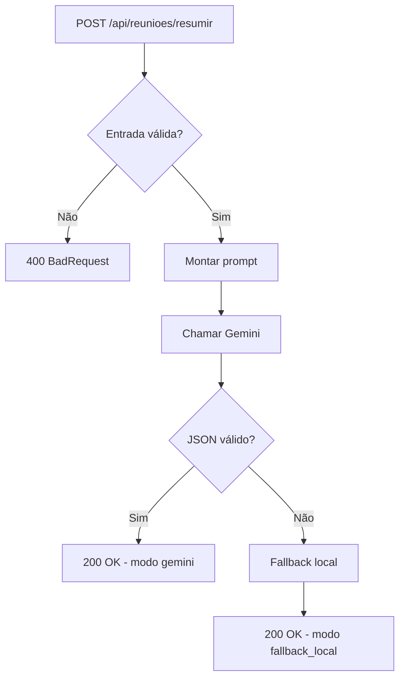

# EasyMeet

## Descrição do projeto
EasyMeet é uma API REST desenvolvida em ASP.NET Core .NET 9 para analisar transcrições de reuniões e transformar conteúdo textual em informações estruturadas para apoio à tomada de decisão.

A solução foi construída para uma atividade acadêmica de IA aplicada ao desenvolvimento de software, com foco em engenharia de prompts, integração com modelo generativo e confiabilidade de saída.

## Problema resolvido
Em rotinas de times, reuniões geram grande volume de informações não estruturadas. Isso dificulta:
- recuperação rápida de decisões;
- rastreio de ações e responsáveis;
- classificação do tipo de reunião;
- documentação consistente para acompanhamento.

## Papel da IA no sistema
A IA exerce papel funcional central no produto.

Responsabilidades da IA:
- resumir reunião;
- identificar tópicos principais;
- identificar ações;
- identificar responsáveis;
- classificar o tipo da reunião;
- estimar nível de confiança da análise.

Quando a IA falha, a API usa fallback local e mantém o contrato de saída.

## Tecnologias utilizadas
- .NET 9
- ASP.NET Core Web API
- Swagger / OpenAPI (Swashbuckle)
- xUnit
- HttpClientFactory
- Google Gemini API (`gemini-2.5-flash`)
- Mermaid

## Arquitetura
- `Controllers`: entrada HTTP e validações.
- `Services`: regra de negócio, agente de IA e integração Gemini.
- `Prompts`: engenharia de prompt e template.
- `Models`: contratos de entrada/saída.

## Estrutura de pastas
```text
EasyMeet/
├── src/
│   └── EasyMeet.Api/
│       ├── Controllers/
│       ├── Services/
│       ├── Models/
│       ├── Prompts/
│       ├── wwwroot/
│       └── Program.cs
├── tests/
│   └── EasyMeet.Tests/
├── docs/
│   ├── PRD.md
│   ├── VIABILIDADE.md
│   ├── BACKLOG.md
│   ├── UML.md
│   ├── ADR.md
│   ├── DIRETRIZES_IA.md
│   └── prompts.md
└── .github/
```

## Fluxo da aplicação
1. Cliente envia `POST /api/reunioes/resumir` com `texto`.
2. Controller valida entrada.
3. Serviço monta prompt estruturado.
4. Serviço chama Gemini 2.5 Flash.
5. API valida JSON de retorno da IA.
6. Em sucesso: `modoExecucao = "gemini"`.
7. Em falha: fallback local com `modoExecucao = "fallback_local"`.

## Fluxograma (Mermaid)


## Como executar
```powershell
dotnet restore
dotnet build
dotnet run --project .\src\EasyMeet.Api\EasyMeet.Api.csproj
```

## Como configurar `GEMINI_API_KEY`
```powershell
$env:GEMINI_API_KEY="SUA_CHAVE_AQUI"
```

## Como rodar testes
```powershell
dotnet test .\tests\EasyMeet.Tests\EasyMeet.Tests.csproj
```

## Interface web
- Acesse `/` para usar a interface web simples de teste.
- Acesse `/swagger` para testar via OpenAPI.

## Exemplo de request
```json
{
  "texto": "Na reunião de status, o time revisou o andamento das entregas..."
}
```

## Exemplo de response
```json
{
  "resumo": "",
  "topicosPrincipais": [],
  "acoes": [],
  "responsaveis": [],
  "tipoReuniao": "",
  "nivelConfianca": 0.0,
  "geradoPorIA": true,
  "modoExecucao": "gemini"
}
```

## Decisões técnicas
- Integração Gemini com `HttpClientFactory`.
- Fallback local obrigatório.
- Validação rígida do JSON da IA.
- Testes automatizados sem chamadas externas reais.

## Limitações conhecidas
- Fallback local é simplificado.
- Sem persistência de dados nesta versão.
- Sem autenticação/autorização nesta etapa acadêmica.

## Melhorias futuras
- Persistência em banco.
- Dashboard de métricas.
- Upload de áudio com transcrição.
- Testes E2E.

## Referências de documentação
- [PRD](docs/PRD.md)
- [Viabilidade](docs/VIABILIDADE.md)
- [Backlog](docs/BACKLOG.md)
- [UML](docs/UML.md)
- [ADR](docs/ADR.md)
- [Diretrizes de IA](docs/DIRETRIZES_IA.md)
- [Prompts](docs/prompts.md)

