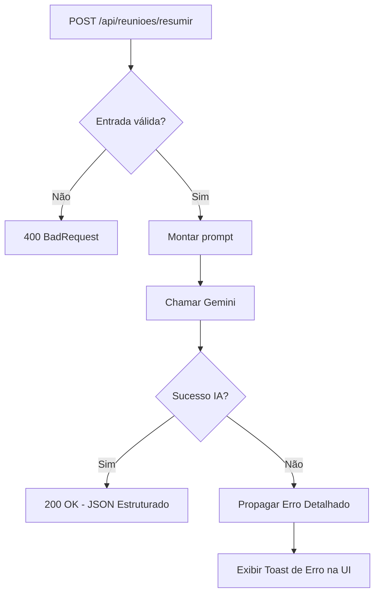

# EasyMeet

## Descrição do projeto
EasyMeet é uma API REST desenvolvida em ASP.NET Core .NET 9 para analisar transcrições de reuniões e transformar conteúdo textual em informações estruturadas para apoio à tomada de decisão.

A solução foi construída para uma atividade acadêmica de IA aplicada ao desenvolvimento de software, com foco em engenharia de prompts, integração com modelo generativo e confiabilidade de saída.

## Problema resolvido
Em rotinas de times, reuniões geram grande volume de informações não estruturadas. Isso dificulta:
- recuperação rápida de decisões;
- rastreio de ações e responsáveis;
- classificação do tipo de reunião;
- documentação consistente para acompanhamento.

## Papel da IA no sistema
A IA exerce papel funcional central no produto.

Responsabilidades da IA:
- resumir reunião;
- identificar tópicos principais;
- identificar ações;
- identificar responsáveis;
- classificar o tipo da reunião;
- estimar nível de confiança da análise.

## Tratamento de Erros e Transparência
Diferente de abordagens que ocultam falhas, o EasyMeet prioriza a transparência. Quando ocorre um erro na integração com a IA (ex: timeout, chave inválida ou resposta fora do padrão):
- O sistema interrompe o fluxo de fallback automático silencioso.
- Uma exceção detalhada é propagada até a interface.
- O usuário visualiza o erro específico através de uma caixa de diálogo suspensa (toast), permitindo o diagnóstico imediato do problema.

## Tecnologias utilizadas
- .NET 9
- ASP.NET Core Web API
- Swagger / OpenAPI (Swashbuckle)
- xUnit
- HttpClientFactory
- Google Gemini API (`gemini-2.5-flash`)
- Vanilla HTML/JS/CSS (Frontend organizado e desacoplado)

## Arquitetura
- `Controllers`: entrada HTTP e validações.
- `Services`: regra de negócio, agente de IA e integração Gemini (configurada via `IOptions`).
- `Prompts`: engenharia de prompt e template.
- `Models`: contratos de entrada/saída.
- `wwwroot`: Interface web com separação clara de responsabilidades (HTML, CSS e JS em arquivos distintos).

## Estrutura de pastas
```text
EasyMeet/
├── src/
│   └── EasyMeet.Api/
│       ├── Controllers/
│       ├── Services/
│       ├── Models/
│       ├── Prompts/
│       ├── wwwroot/
│       │   ├── css/        # Estilos desacoplados
│       │   ├── js/         # Lógica de interface desacoplada
│       │   └── index.html  # Estrutura HTML limpa
│       └── Program.cs
├── tests/
│   └── EasyMeet.Tests/
├── docs/
│   └── ... (Documentação técnica)
└── .github/
```

## Fluxo da aplicação
1. Cliente envia `POST /api/reunioes/resumir` com `texto`.
2. Controller valida entrada.
3. Serviço monta prompt estruturado.
4. Serviço chama Gemini 2.5 Flash utilizando a API Key configurada no `appsettings.json`.
5. API valida JSON de retorno da IA.
6. **Sucesso**: Retorna o JSON estruturado e a interface distribui os dados em campos específicos.
7. **Falha**: Retorna o erro específico (400, 504, 500) e a interface exibe o alerta (Toast) para o usuário.

## Fluxograma (Mermaid)


## Como executar
```powershell
dotnet restore
dotnet build
dotnet run --project .\src\EasyMeet.Api\EasyMeet.Api.csproj
```

## Como configurar `GEMINI_API_KEY`
A chave deve ser configurada no arquivo `src/EasyMeet.Api/appsettings.json` (ou `appsettings.Development.json`):

```json
{
  "Gemini": {
    "ApiKey": "SUA_CHAVE_AQUI",
    "ModoExecucao": "Producao"
  }
}
```

## Como rodar testes
```powershell
dotnet test .\EasyMeet.sln
```

## Interface web
- Acesse `/` para usar a interface web. Agora com campos detalhados para Tópicos, Ações, Responsáveis e Nível de Confiança.
- Erros de integração são exibidos no topo da tela em um alerta vermelho.

## Exemplo de request
```json
{
  "texto": "Na reunião de status, o time revisou o andamento das entregas..."
}
```

## Exemplo de response (Sucesso)
```json
{
  "resumo": "O time revisou entregas e definiu prazos.",
  "topicosPrincipais": ["Status das entregas", "Cronograma"],
  "acoes": ["Atualizar Jira"],
  "responsaveis": ["Time de dev"],
  "tipoReuniao": "Status",
  "nivelConfianca": 0.95,
  "geradoPorIA": true,
  "modoExecucao": "gemini"
}
```

## Decisões técnicas
- **Transparência de Erros**: Remoção do fallback silencioso em favor de mensagens explícitas para o usuário final.
- **Configuração Forte**: Uso de `IOptions<GeminiSettings>` para leitura centralizada de configurações.
- **Organização Frontend**: Separação de arquivos para melhorar manutenibilidade e performance.

## Referências de documentação
- [PRD](docs/PRD.md)
- [Viabilidade](docs/VIABILIDADE.md)
- [Backlog](docs/BACKLOG.md)
- [UML](docs/UML.md)
- [ADR](docs/ADR.md)
- [Diretrizes de IA](docs/DIRETRIZES_IA.md)
- [Prompts](docs/prompts.md)
