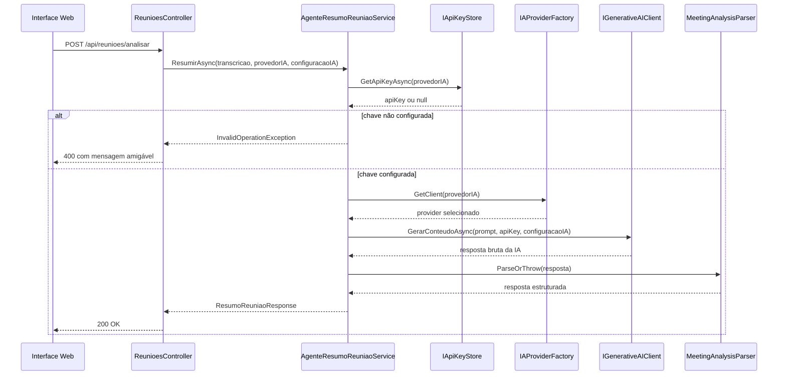
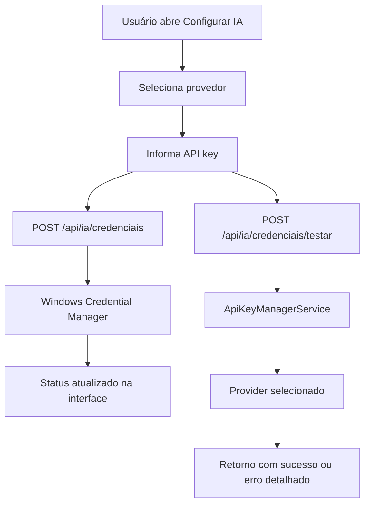
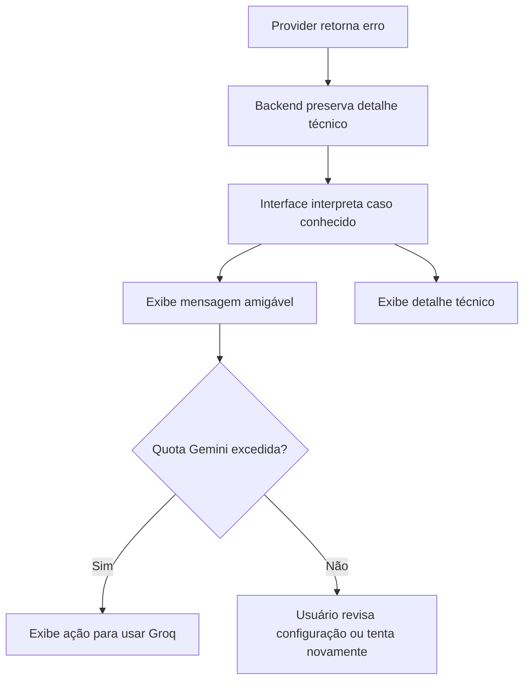

# UML - EasyMeet

## Diagrama de classes

```mermaid
classDiagram
    class ReunioesController {
      +ResumirAsync(request, cancellationToken)
    }

    class IAConfigController {
      +ListarProvedores()
      +ObterStatus(cancellationToken)
      +SalvarCredencial(request, cancellationToken)
      +RemoverCredencial(provedor, cancellationToken)
      +TestarCredencial(request, cancellationToken)
    }

    class IAgenteResumoReuniaoService {
      <<interface>>
      +ResumirAsync(transcricao, provedorIA, configuracaoIA, cancellationToken)
    }

    class AgenteResumoReuniaoService {
      -PromptResumoReuniaoBuilder promptBuilder
      -IApiKeyStore apiKeyStore
      -IAProviderFactory providerFactory
      -MeetingAnalysisParser parser
    }

    class IAProviderFactory {
      <<interface>>
      +GetClient(provedorIA)
      +ListarProvedores()
    }

    class AIProviderFactory {
      -Dictionary~ProvedorIA, IGenerativeAIClient~ providers
    }

    class IGenerativeAIClient {
      <<interface>>
      +Provedor
      +GerarConteudoAsync(prompt, apiKey, configuracaoIA, cancellationToken)
      +TestarConexaoAsync(apiKey, cancellationToken)
    }

    class IApiKeyStore {
      <<interface>>
      +SaveApiKeyAsync(provedor, apiKey, cancellationToken)
      +GetApiKeyAsync(provedor, cancellationToken)
      +DeleteApiKeyAsync(provedor, cancellationToken)
      +HasApiKeyAsync(provedor, cancellationToken)
    }

    class ApiKeyManagerService
    class WindowsCredentialApiKeyStore
    class MeetingAnalysisParser
    class PromptResumoReuniaoBuilder
    namespace Providers {
      class GeminiClientService
      class GroqClientService
      class OpenAIClientService
      class AnthropicClientService
      class MistralClientService
      class CohereClientService
      class AzureOpenAIClientService
    }

    ReunioesController --> IAgenteResumoReuniaoService
    IAConfigController --> ApiKeyManagerService
    IAConfigController --> IAProviderFactory
    AgenteResumoReuniaoService ..|> IAgenteResumoReuniaoService
    AgenteResumoReuniaoService --> PromptResumoReuniaoBuilder
    AgenteResumoReuniaoService --> IApiKeyStore
    AgenteResumoReuniaoService --> IAProviderFactory
    AgenteResumoReuniaoService --> MeetingAnalysisParser
    AIProviderFactory ..|> IAProviderFactory
    AIProviderFactory --> IGenerativeAIClient
    WindowsCredentialApiKeyStore ..|> IApiKeyStore
    ApiKeyManagerService --> IApiKeyStore
    ApiKeyManagerService --> IAProviderFactory
    GeminiClientService ..|> IGenerativeAIClient
    GroqClientService ..|> IGenerativeAIClient
    OpenAIClientService ..|> IGenerativeAIClient
    AnthropicClientService ..|> IGenerativeAIClient
    MistralClientService ..|> IGenerativeAIClient
    CohereClientService ..|> IGenerativeAIClient
    AzureOpenAIClientService ..|> IGenerativeAIClient
```

## Sequência de análise de reunião

```mermaid
sequenceDiagram
    participant UI as Interface Web
    participant RC as ReunioesController
    participant ARS as AgenteResumoReuniaoService
    participant KS as IApiKeyStore
    participant PF as IAProviderFactory
    participant AI as IGenerativeAIClient
    participant Parser as MeetingAnalysisParser

    UI->>RC: POST /api/reunioes/analisar
    RC->>ARS: ResumirAsync(transcricao, provedorIA, configuracaoIA)
    ARS->>KS: GetApiKeyAsync(provedorIA)
    KS-->>ARS: apiKey ou null

    alt chave não configurada
      ARS-->>RC: InvalidOperationException
      RC-->>UI: 400 com mensagem amigável
    else chave configurada
      ARS->>PF: GetClient(provedorIA)
      PF-->>ARS: provider selecionado
      ARS->>AI: GerarConteudoAsync(prompt, apiKey, configuracaoIA)
      AI-->>ARS: resposta bruta da IA
      ARS->>Parser: ParseOrThrow(resposta)
      Parser-->>ARS: resposta estruturada
      ARS-->>RC: ResumoReuniaoResponse
      RC-->>UI: 200 OK
    end
```

## Fluxo de configuração de credenciais

```mermaid
flowchart TD
  A[Usuário abre Configurar IA] --> B[Seleciona provedor]
  B --> C[Informa API key]
  C --> D[POST /api/ia/credenciais]
  D --> E[Windows Credential Manager]
  E --> F[Status atualizado na interface]
  C --> G[POST /api/ia/credenciais/testar]
  G --> H[ApiKeyManagerService]
  H --> I[Provider selecionado]
  I --> J[Retorno com sucesso ou erro detalhado]
```

## Fluxo de tratamento de erro de IA

```mermaid
flowchart TD
  A[Provider retorna erro] --> B[Backend preserva detalhe técnico]
  B --> C[Interface interpreta caso conhecido]
  C --> D[Exibe mensagem amigável]
  C --> E[Exibe detalhe técnico]
  D --> F{Quota Gemini excedida?}
  F -->|Sim| G[Exibe ação para usar Groq]
  F -->|Não| H[Usuário revisa configuração ou tenta novamente]
```
