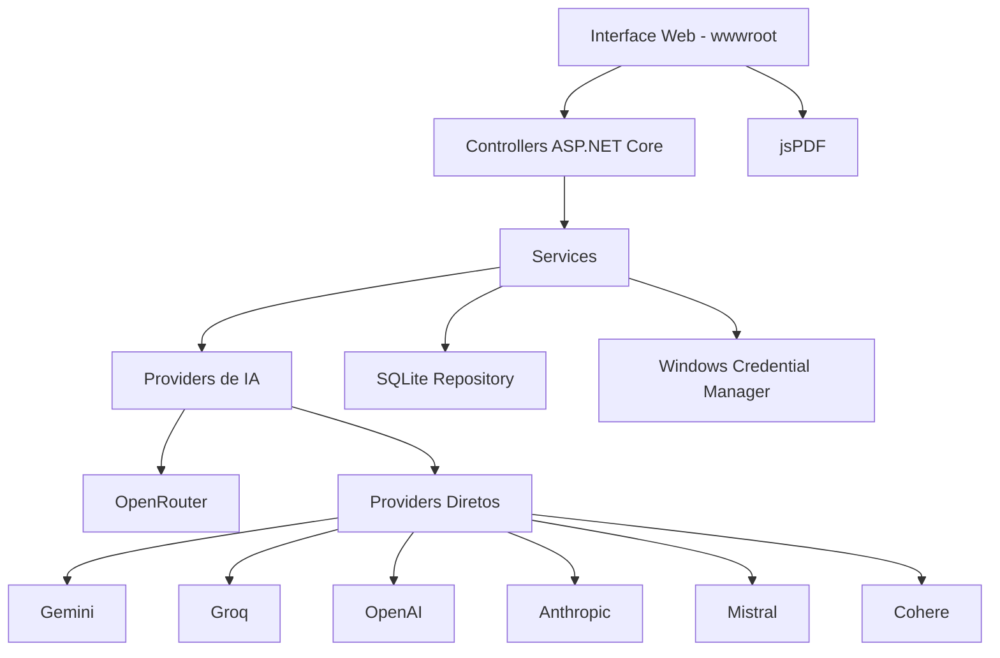
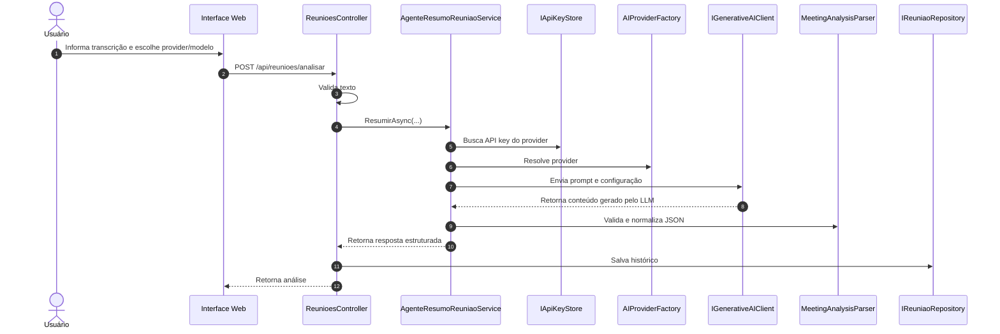
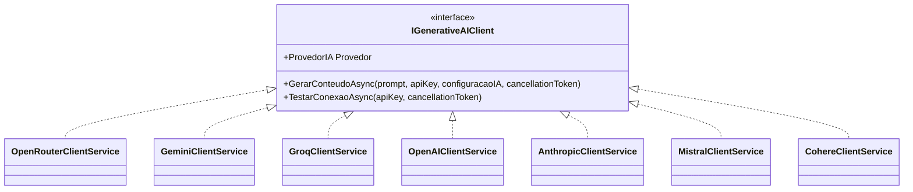
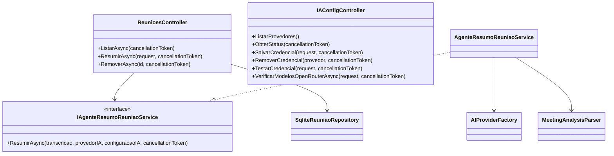
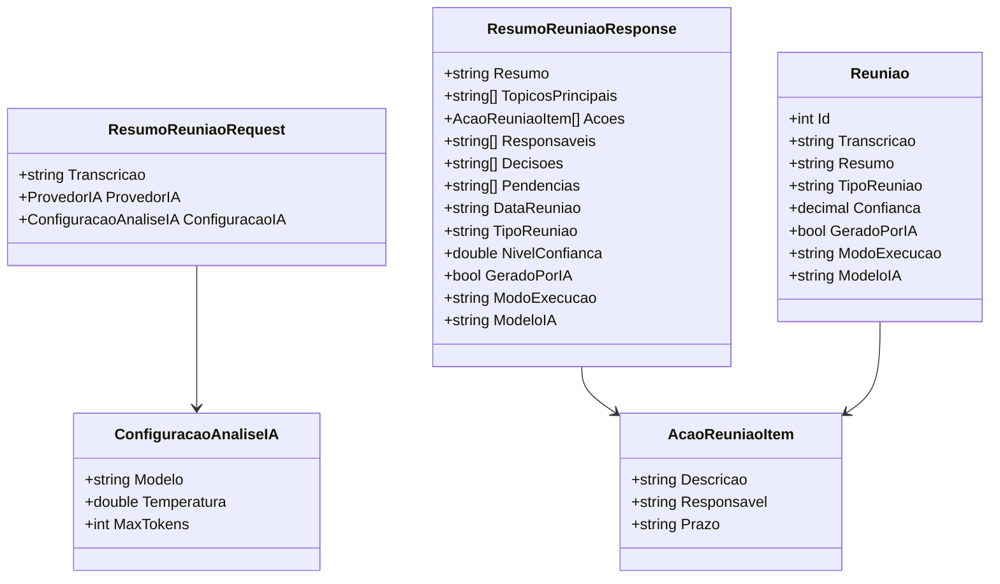
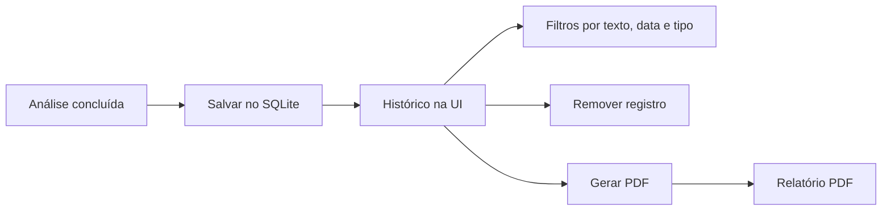
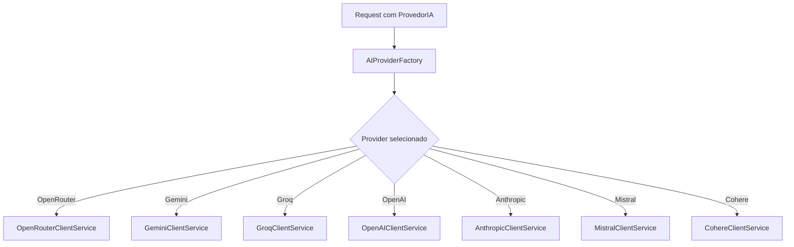

# UML - EasyMeet

Este documento apresenta diagramas Mermaid para representar a arquitetura atual do EasyMeet.

## Arquitetura Geral

## Fluxo de Análise

## Providers de IA

## Controllers e Services

## Relacionamento Das Entidades

## Histórico e PDF

## Fluxo Multi-Provider

